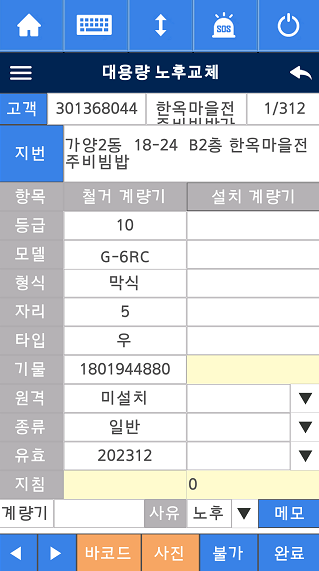
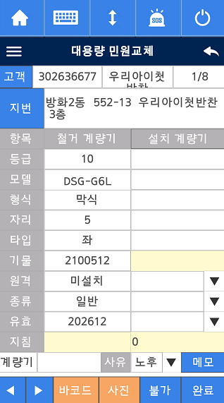

# 대용량 노후(민원)교체

---

## 노후 교체

---

## 민원 교체

---

## 1. 입력필드와 매핑되는 필드명

| 화면 표시명 | 입력/출력 컨트롤 | stMtrChg 필드명           | 비고                                                    |
| ----------- | ---------------- | ------------------------- | ------------------------------------------------------- |
| 등급        | TXT_DATA9        | AFTER_MTR_GRD             | 설치계량기 등급                                         |
| 모델        | TXT_DATA12       | AFTER_MTR_MODEL_CD (코드) | 설치계량기 모델명은 쿼리로 변환, 모델명은 쿼리로 가져옴 |
| 형식        | TXT_DATA15       | AFTER_MTR_FORM            | 설치계량기 형식(막식/터빈 등)                           |
| 자리        | TXT_DATA18       | AFTER_MTR_DIGIT_CNT       | 설치계량기 자리수                                       |
| 타입        | TXT_DATA21       | AFTER_MTR_TYPE            | 설치계량기 타입                                         |
| 기물        | EDT_DATA1        | AFTER_MTR_ID_NUM          | 설치계량기 기물번호                                     |
| 원격        | CMB_DATA1        | AFTER_MTR_REMOTE_FLAG     | 설치계량기 원격여부(콤보)                               |
| 종류        | CMB_DATA2        | AFTER_MTR_KIND            | 설치계량기 종류(콤보)                                   |
| 유효        | CMB_DATA3        | AFTER_MTR_VALID_YM        | 설치계량기 유효년월(콤보)                               |
| 지침        | EDT_DATA3        | INST_INDI_VC              | 설치계량기 지침                                         |
| 계량기      | TXT_DATA1        | MTR_NUM                   | 계량기번호                                              |
| 노후(사유)  | CMB_DATA4        | MTR_REPL_WHY              | 교체사유(콤보)                                          |
| 철거 지침   | EDT_DATA2        | REMOVE_INDI_VC            | 철거계량기 지침                                         |

---

## 2. 콤보박스 리스트 데이터 소스

- **원격 (CMB_DATA1):**

  - 테이블: `COMMONCODE`
  - CODE_ID: `'C30008'`
  - ITEM_KNAME: 콤보박스에 표시될 값

- **종류 (CMB_DATA2):**

  - CODE_ID: `'C30087'`

- **유효 (CMB_DATA3):**

  - `SetCombo_Valid()` 함수에서 현재 등급(MTR_GRD)에 따라 유효년월을 계산해서 리스트에 추가
  - 등급에 따라 5년/8년/10년 등으로 유효년월을 자동 생성하여 콤보박스에 넣음

- **노후(사유) (CMB_DATA4):**
  - CODE_ID: `'C30009'`
  - CODE_ITEM: `'300'`, `'001'` 제외

---

## 3. 완료 버튼(저장) 눌렀을 때의 벨리데이션 문구와 발생 조건

- "기물번호를 입력하세요."
  - 조건: 아래 중 하나라도 비어있으면  
    `EditCtrl_GetStr(Get_hDlgCtrlByID(EDT_DATA1)) == 0`  
    `TXT_DATA12 (모델) == 0`  
    `TXT_DATA18 (자리) == 0`  
    `TXT_DATA9 (등급) == 0`
- "원격여부를 선택하세요."
  - 조건: `CMB_DATA1 (원격) == 0`
- "계량기 종류를 선택하세요."
  - 조건: `CMB_DATA2 (종류) == 0`
- "계량기 유효년월을 선택하세요."
  - 조건: `CMB_DATA3 (유효) == 0`
- "철거 계량기 지침을 입력하세요."
  - 조건: `EDT_DATA2 (철거 지침) == 0`
- "설치 계량기 지침을 입력하세요."
  - 조건: `EDT_DATA3 (설치 지침) == 0`
- "계량기 교체사유를 선택하세요."
  - 조건: `CMB_DATA4 (노후/사유) == 0`
- AMI 관련
  - 조건: `(m_szMtr == "AMI" && m_szRemote == "NB-IoT")` 이고, 아래 중 하나라도 비어있으면  
    `stMtrChg.COMM_FIRM == 0`  
    `stMtrChg.COMM_NUM_24 == 0`  
    `stMtrChg.INFLOW_FLAG == 0`
  - 문구: (생략되어 있지만, AMI 관련 입력이 누락되면 벨리데이션 실패)
- "계량기 사진을 촬영하세요."
  - 조건: 철거/설치 계량기 사진 파일이 존재하지 않으면
- "교체사유 변경으로 진행을 확인합니다."
  - 조건: `CMB_DATA4(사유)`가 "노후"가 아닐 때, YES/NO 확인창
- 보정기 보유 시
  - 조건: `g_nBojungFlag == 1`
  - 동작: 보정기 화면으로 이동(벨리데이션 실패)
- 지침입력 필요
  - 조건: `stMtrChg.REVIS_FLAG == "20"`
  - 동작: 지침입력 화면으로 이동(벨리데이션 실패)
