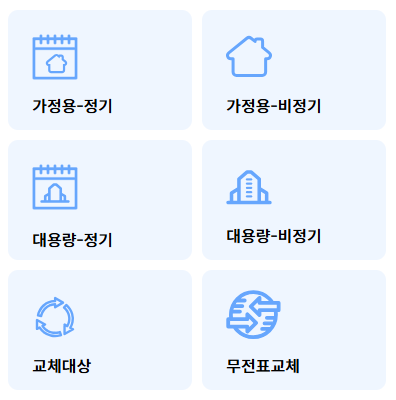
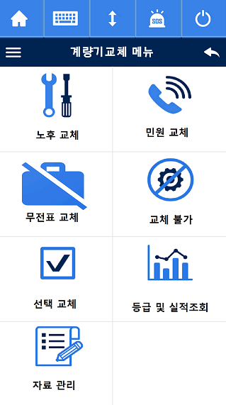

# 메뉴

---

---

## AS-IS

- **프로그램명:** `C601_MENU.mc`

| 구분  | 소분류             | 대분류     |
| ----- | ------------------ | ---------- |
| AS-IS | 노후, 민원, 무전표 | 노후, 민원 |

---

## TO-BE

| 구분  | 소분류               | 대분류       |
| ----- | -------------------- | ------------ |
| TO-BE | 정기, 비정기, 무전표 | 정기, 비정기 |

---

## 교체 대상

<!-- 필요시 교체 대상에 대한 설명 추가 -->

| 필드명      | 한글명         | 예시값                                                                           |
| ----------- | -------------- | -------------------------------------------------------------------------------- |
| gubun       | 구분           | 철거계량기(MBM), 설치계량기(MAM), 철거보정기(CBM), 설치보정기(CAM), 교체불가('') |
| mtrNum      | 계량기번호     | 300443976                                                                        |
| nobillYn    | 청구 없음 여부 | N                                                                                |
| photo       | 사진           | data:image/gif;base64,R0lGODlhAAEAAcQAALe9v9ve3... (BASE64 인코딩 이미지)        |
| employeeId  | 등록자사번     | 200710006                                                                        |
| equipTelNum | 등록IP         | 010-0000-0000                                                                    |
