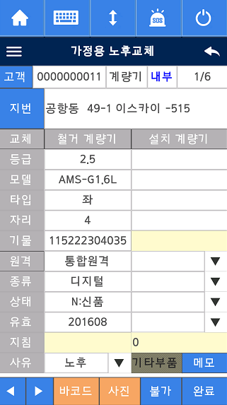

# 소용량 노후(민원)교체

C6301_MTRCHG.md

---

## 가정용 노후교체

---

## 가정용 민원교체

---

## AMI 민원교체, 가정용 무전표교체

---

## 1. 입력필드와 매핑되는 필드명

| 화면 필드명 | 코드 내 매핑 필드명 (stMtrChg)         | 비고/설명           |
| ----------- | -------------------------------------- | ------------------- |
| 등급        | AFTER_MTR_GRD                          | 설치계량기 등급     |
| 모델        | AFTER_MTR_MODEL_CD, AFTER_MTR_MODEL_NM | 모델코드, 모델명    |
| 타입        | AFTER_MTR_TYPE                         | 설치계량기 타입     |
| 자리        | AFTER_MTR_DIGIT_CNT                    | 설치계량기 자리수   |
| 기물        | AFTER_MTR_ID_NUM                       | 설치계량기 기물번호 |
| 원격        | AFTER_MTR_REMOTE_FLAG                  | 설치계량기 원격구분 |
| 종류        | AFTER_MTR_KIND                         | 설치계량기 종류     |
| 상태        | AFTER_MTR_NEW_FIX_FLAG                 | 설치계량기 상태     |
| 유효        | AFTER_MTR_VALID_YM                     | 설치계량기 유효년월 |
| 지침        | INST_INDI_VC                           | 설치계량기 지침     |
| 사유        | MTR_REPL_WHY                           | 교체사유            |
| 기타부품    | OTHER_PRICE                            | 기타부품(직접입력)  |

- 철거계량기 관련 필드는 `MTR_`로 시작 (예: `MTR_GRD`, `MTR_ID_NUM` 등)
- 설치계량기 관련 필드는 `AFTER_MTR_`로 시작

---

## 2. 콤보박스 리스트의 데이터 소스

콤보박스는 대부분 **공통코드 테이블(COMMONCODE)**에서 가져옵니다.

| 콤보박스 | 코드상 오브젝트ID | 공통코드 CODE_ID | 쿼리 예시                                                    |
| -------- | ----------------- | ---------------- | ------------------------------------------------------------ |
| 원격     | CMB_DATA1         | C30008           | `SELECT ITEM_KNAME FROM COMMONCODE WHERE CODE_ID = 'C30008'` |
| 종류     | CMB_DATA2         | C30087           | `SELECT ITEM_KNAME FROM COMMONCODE WHERE CODE_ID = 'C30087'` |
| 상태     | CMB_DATA3         | C30004           | `SELECT ITEM_KNAME FROM COMMONCODE WHERE CODE_ID = 'C30004'` |
| 유효     | CMB_DATA4         | (직접생성, 년월) | 코드에서 년월을 조합해서 직접 생성                           |
| 사유     | CMB_DATA5         | C30009           | `SELECT ITEM_KNAME FROM COMMONCODE WHERE CODE_ID = 'C30009'` |

- 유효(CMB_DATA4)는 코드에서 현재 년월 기준으로 5년치 등 직접 생성
- 상태(CMB_DATA3)는 복합 쿼리로 여러 코드 조합을 만듦
- 사유(CMB_DATA5)는 교체사유 코드

---

## 3. 완료 버튼(저장) 눌렀을 때의 벨리데이션 문구와 발생 조건

### 1) 필수 입력 누락

- 문구:
  - "설치계량기 기물번호를 입력하세요."
  - "설치계량기 등급을 입력하세요."
  - "설치계량기 자리수를 입력하세요."
  - "설치계량기 종류를 선택하세요."
  - "설치계량기 원격구분을 선택하세요."
  - "설치계량기 상태를 선택하세요."
  - "설치계량기 유효년월을 선택하세요."
  - "철거계량기 지침을 입력하세요."
  - "설치계량기 지침을 입력하세요."
  - "교체사유를 선택하세요."
- 조건: 각 필드의 값이 비어있을 때 (`Str_Len(...) == 0`)

### 2) 기물번호 불일치

- 문구: "바코드와 기물번호가 일치하지 않습니다."
- 조건: 바코드에서 읽은 기물번호와 입력된 기물번호가 다를 때

### 3) 사진 미촬영

- 문구: "계량기 사진을 촬영하세요."
- 조건: 사진 파일이 존재하지 않을 때 (`FFS_Exist`로 체크)

### 4) 교체사유 변경 확인

- 문구: "교체사유 변경으로\n진행을 확인합니다."
- 조건: 사유가 '노후'가 아닐 때, 사용자가 변경을 확인해야 함

### 5) 철거지침이 전월지침보다 작음

- 문구: "철거지침(%s)이\n전월지침(%s)보다 작습니다.\n계속 진행하시겠습니까?"
- 조건: 철거지침 값이 전월지침보다 작을 때

### 6) 보정기 보유시

- 문구: (별도 메시지 없이 보정기 교체 카드로 이동)
- 조건: `g_nBojungFlag == 1` (보정기 보유)

### 7) 특수형 계량기 종류/원격구분 불일치

- 문구: (특수형 계량기에서 종류/원격구분이 다르면 저장 불가, 별도 메시지 가능)
- 조건: 특수형 계량기에서 종류/원격구분이 다를 때

### 8) 기타부품 입력시

- 문구: (기타부품 입력시 별도 처리, 메시지 가능)
- 조건: 기타부품이 '기타부품'일 때
