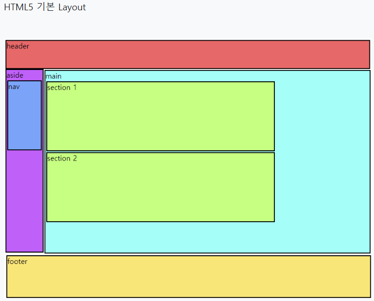

# 기본 레이아웃

```html
<!-- 페이지 최상단 -->
<header />

<!-- Hyperlink, 메뉴바 -->
<nav />

<!-- 카테고리, 현재 페이지 외의 컨텐츠 -->
<aside />

<!-- 현재 페이지 주 컨텐츠가 포함 -->
<main />

<!-- main 내 컨텐츠를 구역별로 다룸 -->
<section />

<!-- 페이지 최하단 -->
<footer />
```



# header

    - 아이콘들 [menuList]
    - 하드코딩 되어 있음
    - 선택된 아이콘에 따라 종목들이 달라짐 [menu]

# aside

    - 종목들 [stockList]
    - api (잔고, 미체결내역, 체결내역, 기간손익, hello) [balanceList, nccsList, ccnlList, profitList, analyzeList]
    - 선택된 종목에 따라 종목정보가 달라짐 [stock]

# main

## main.section1

    - header
    - 버튼 : 설정 아이콘
    - 버튼 : 로그인 버튼 (로그아웃)
    - 버튼 : 시세표시 아이콘

## main.section2

    - 종목들
    - 모바일에서만 보임
    - aside 내용 그대로 표출

## main.section3

    - 나스닥 시세 조회
    - 내 수익률 조회

## main.section4

    - 종목정보 (종목정보에 따라 chart, 종목정보, 커뮤니티가 달라짐)
    - api (현재가 상세)

## main.section5

    - tab

## main.section5.tab1

    - chart
    - 1일, 7일, 1달, 1년, 5년
    - api (기간별 시세)

## main.section5.tab2

    - 종목정보
    - api ()

## main.section5.tab3

    - 커뮤니티
